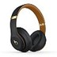
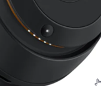
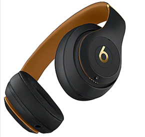
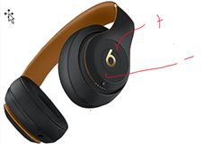
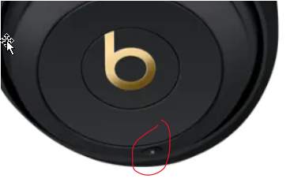
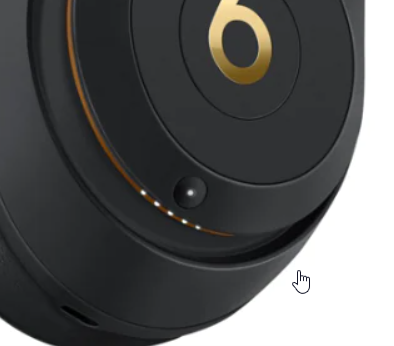

## Journal 1

## Interaction with Beath wireless Headphone 

Beats Studio3 Wireless over-ear headphones delivers premium sound while blocking external noise with Active Noise Cancelling. Premium sound. Real-time audio calibration preserves clarity, range, and emotion to deliver a premium listening experience.

Beat wireless headphones is such a good quality headphone with many great features, but being a first-time user of the headphone, its quite complicated. Figuring out the feature of the headphone and how to use it is sometime annoying. 

The power button has no sign, just a little circle button. When the headphone is not on, you just see a little dented black circle button and when it on, it has a little light in the center of that button. But there is no indication that the button is the power button, usually the power button has a standard symbol like in the second image. 

On the headphone

Common symbol

The same with the volume buttons. Can you tell if there is a volume buttons on the headphone in this picture? 

Probable no, since the usual volume buttons has some type of indication like this or a + and - : 

The volume buttons for this headphone are here, no indicator: 

Ok, so after you figure out where the power button is. How do you connect your device to the headphone? There is no sign for it. There are two buttons, one on each side, but how do you connect to it. There is no indication for those two buttons.  To connect to this device, you will have to press and hold the button mark below for 3 seconds to activate the search for Bluetooth connection and then it device name will appear in the device that you want to connect with it.  

You may think that the set of light below is an indication of the volume, but it is not. That set of light is an indication of battery power. As the battery getting low, this set of light bars will decrease as well. 

Conclusion:
After play around with it for about 2 days, I can finally learn how it work. Memorizes how each button work is hard at first, but once you know how those buttons work, it is easy to use and a nice headphone to have. This beat headphone has a very high quality of sound and the headphone physically looks great. One thing that I kind of did not like is that, if you do not use it for a long period of time, then you will have to figure out the features of those buttons again. 
